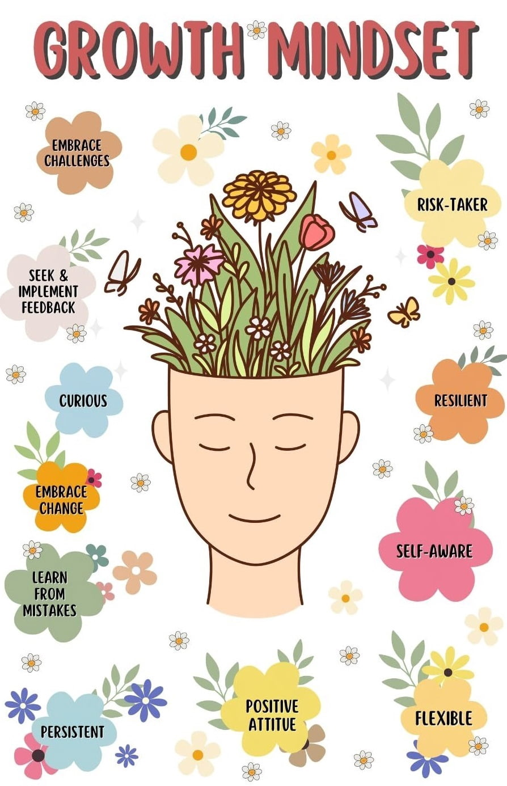

In America, going by BMI,  [72%](https://www.cdc.gov/nchs/fastats/obesity-overweight.htm) of adults and [36%](https://www.cdc.gov/nchs/data/hestat/hestat112.htm) of children are overweight. These figures are [67%](https://www.aihw.gov.au/reports/overweight-obesity/overweight-and-obesity/contents/summary) and [24%](https://www.aihw.gov.au/reports/children-youth/australias-children/contents/health/overweight-obesity) in Australia. Almost [80%](https://www.amacad.org/news/remaining-monolingual-surefire-way-america-fall-behind) of Americans only speak one language at home. The average American, despite being fairly confident with the way they cook, can apparently only make [five dishes](https://www.theladders.com/career-advice/turns-out-americans-really-dont-know-how-to-cook-anything-but-eggs)—mostly breakfast foods—without a recipe. A significant percentage are intimidated by spatulas. The *[tyranny of averages](https://en.wikipedia.org/wiki/Tyranny_of_averages)* is such that based on the average modern human, one might be fooled into believing that it is a sign of unusual excellence to be lean, multilingual, and a competent home cook. It is most assuredly not—and yet in modern society, all of these skills have been turned into "achievements" to admire. **In fact, despite declining results, our society is *obsessed* with "achievement".** How can this be?

|  | 
|:--:| 
| *A spatula. Absolutely terrifying.* |

## Meaningless "achievement"

In *[The Burnout Society](https://en.wikipedia.org/wiki/The_Burnout_Society)*, the Korean-German philosopher Byung-Chul Han describes our society as one of the *achievement-subject*: we are obsessed with maximising visible outputs. We must produce more, achieve more, extract as much "positive" value as possible from every moment. Negative emotions are repressed, constraints are ignored, and we obsessively fill empty, negative space with "multi-tasking", "productivity" apps, and so on. He calls this the *violence of positivity*. Ironically, as he points out, while this economic *self-exploitation* may be useful in the short term for employers, this ends up producing *less* in the long run. Anyone well versed in physical training understands that most gains in strength and hypertrophy come from *[rest](https://en.wikipedia.org/wiki/Overtraining)* and *[sleep](https://www.mdpi.com/2077-0383/14/21/7606)*. In *[Letters to a Young Poet](https://en.wikipedia.org/wiki/Letters_to_a_Young_Poet)*, the great Austrian poet Rainer Maria Rilke espoused the necessity of contemplation in solitude for producing good work, a theme which has more recently been thoroughly explored by Sherry Turkle in *[Reclaiming Conversation](https://www.goodreads.com/book/show/24612127-reclaiming-conversation)*. Itzhak Perlman, one of the world's most brilliant violinists, advised *[against](https://www.thestrad.com/playing-hub/never-practise-for-more-than-five-hours-per-day-says-violinist-itzhak-perlman/4052.article)* practising more than a few hours a day. You can listen to one of his performances here:

<iframe src="https://www.youtube.com/embed/ueWVV_GnRIA?rel=0" allow="accelerometer; autoplay; encrypted-media; gyroscope; picture-in-picture; fullscreen"></iframe>

And yet conservatories have students practising for eight hours a day; fitness enthusiasts train to failure repeatedly throughout the week; and creatives never have any time to consolidate their thoughts, which should be the basis of their creativity. Han argues that this constant pursuit of "achievement" contributes to the *burnout society*: the modern epidemic of stress, fatigue, and ultimately depression, where people give up entirely on achieving. He is correct. But it would be a mistake to therefore suggest that achievement is bad, that human life should not be optimised. The ancient Greek philosopher Aristotle believed strongly that things in life should have a *telos*—some intentional, greater purpose beyond unquestioned instinct. In *[Nicomachean Ethics](https://en.wikipedia.org/wiki/Nicomachean_Ethics#Synopsis)*, he proposed that all action should be measured against the highest good of *eudaimonia*, a Greek word often translated as "flourishing". The problem in modernity, then, is a lack of *telos*. The *achievement-subject* chases "achievement" without telos—instead, they try to maximise socially visible output at any cost, regardless of whether such an output actually contributes to a coherent life. More social media followers does not make you less lonely. More money does not make you healthier. More sexual partners does not make you happier. In fact, the *opposite* is generally true, perhaps most beautifully articulated in **[Ecclesiastes 2:8–11](https://www.biblegateway.com/passage/?search=Ecclesiastes%202%3A8-11&version=KJV)**:

> I gathered me also silver and gold, and the peculiar treasure of kings and of the provinces: I gat me men singers and women singers, and the delights of the sons of men, as musical instruments, and that of all sorts. So I was great, and increased more than all that were before me in Jerusalem: also my wisdom remained with me. And whatsoever mine eyes desired I kept not from them, I withheld not my heart from any joy; for my heart rejoiced in all my labour: and this was my portion of all my labour. Then I looked on all the works that my hands had wrought, and on the labour that I had laboured to do: and, behold, all was vanity and vexation of spirit, and there was no profit under the sun.

**All is vanity,** and yet there are clearly goods worth pursuing anyway, as in **[Ecclesiastes 5:18](https://www.biblegateway.com/passage/?search=Ecclesiastes%205%3A18-20&version=KJV)**:

> Behold that which I have seen: it is good and comely for one to eat and to drink, and to enjoy the good of all his labour that he taketh under the sun all the days of his life, which God giveth him: for it is his portion.

This is a theme further elaborated upon in **[Galatians 5:22–23](https://www.biblegateway.com/passage/?search=Galatians%205:22-23&version=KJV)**:

> But the fruit of the Spirit is love, joy, peace, longsuffering, gentleness, goodness, faith, meekness, temperance: against such there is no law.

Here, we see the cause of modern burnout. Most of what people obsess over—better grades, more exciting relationships, a wider audience—are actively *draining*, and prioritise short-term approval over long-term fruits. Meanwhile, all the boring acts of discipline that actually produce a good life—healthy eating, an active lifestyle, and unseen acts of generosity and kindness—are sabotaged. When people *do* attempt to actually improve their lives, they chase rapid results, fail, and give up. They overtrain. They eat too little or too much. They practise for hours longer than they can focus. They don't get enough sleep. Anyone who has been seriously sick for months because they exercised beyond their capacity understands this. It is far more impressive to *resist* the temptation to overdo something. There is a difference between a strong work ethic and *stupidity*: the latter is made of insecurity and desperation.

But the true stupidity of achievement culture is that most worthwhile "achievements" are actually solutions to problems that *we created*:

- Obesity is a modern problem. As David Raubenheimer and Stephen J Simpson explain in *[Eat Like the Animals](https://www.goodreads.com/book/show/52202989-eat-like-the-animals)*, we gain weight because our ultraprocessed modern diets are unusually low in protein. Our bodies try to get more protein by eating more. The unusually low fibre in our diets screws us up even more.
- Social isolation is a modern problem. As American political scientist Robert D Putnam explores in *[Bowling Alone](https://en.wikipedia.org/wiki/Bowling_Alone)*, participation in civic and religious organisations has been declining for decades.
- Not knowing how to cook is a modern problem. I'm Korean. My parents can cook. My grandparents could cook. Quite well, actually. This was the norm for most of human history.

Our standards are now so low that we treat **basic human function** as an admirable "achievement". In other words, not only is burnout a result of short-term validation chasing, but also literally because the human capacities that should provide resilience have been systematically eroded since childhood.

|  |
|:--:| 
| *I like to minimise administrative burden. It tastes great and meets all my nutritional requirements. Cooking doesn't need to be fancy.* |

## Lowering standards

So far, we've established that:

- We are obsessed with "achievement".
- **This obsession with maximising visible, draining achievements actively sabotages actually healthy achievement.**
- Healthy achievement isn't even really an achievement in the first place; it's a *restoration* of capacities we should already have had.
- Burnout and depression is a result of being unable to meet the expectation of constant socially approved output that does not serve coherent life, combined with the erosion of the capacities that allow for output in the first place.

We *should* set high standards. Impossibly high standards, even—but only for things that make life *actually better*, and only in ways that do not sacrifice the organism that must embody these standards. But how did it come to be that we now see being lean, fit, charismatic and skilled as an "achievement"? Well, part of it is of course that the standard naturally drifted lower due to people becoming more crippled and degraded. But it's also due to how they *responded* to this decline. Accelerating particularly in the 1960s, in an environment of growing physical and socioeconomic insecurity and discontent, a radical culture of Progressivism blossomed. As documented by American historian Christopher Lasch in *[The Culture of Narcissism](https://en.wikipedia.org/wiki/The_Culture_of_Narcissism)*, this cursed blend of left-liberal-progressive ideologues set themselves on a mission to eliminate constraint and negativity. Anything was possible. Anyone could do anything. Everyone could be equal—the Same, in fact. We just had to be more inclusive, affirmative, and considerate of the words we used to describe things, regardless of the underlying reality.

|  |
|:--:| 
| *Who knows? Maybe men can even be women.* |

Lasch used the leftist criticism of sports as an example of this idiocy:

> Left-wing criticism of sport provides one of the most vivid examples of the essentially conformist character of the "cultural revolution" with which it identifies itself. According to Paul Hoch, Jack Scott, Dave Meggyesy, and other cultural radicals, sport is a "mirror reflection" of society that indoctrinates the young with the dominant values. In America, organized athletics teach militarism, authoritarianism, racism, and sexism, thereby perpetuating the "false consciousness" of the masses. Sports serve as an "opiate" of the people, diverting the masses from their real problems with a "dream world" of glamour and excitement...For all these reasons, organized competition should give way to "intramural sports aimed at making everyone a player." If everyone "had fulfilling, creative jobs, they wouldn't need to look for the pseudo satisfactions of being fans."

He described the leftist aversion to standards:

> It shows its contempt for excellence by proposing to break down the "elitist" distinction between players and spectators. It proposes to replace competitive professional sports, which notwithstanding their shortcomings uphold standards of competence and bravery that might otherwise become extinct, with a bland regimen of cooperative diversions in which everyone can join regardless of age or ability—"new sports for the noncompetitive," having "no object, really," according to a typical effusion, except to bring "people together to enjoy each other."

Lasch correctly countered that *"play at its best is always serious; indeed...the essence of play lies in taking seriously activities that have no purpose, serve no utilitarian ends."* He went on to criticise mass education:

> The extension of formal schooling to groups formerly excluded from it is one of the most striking developments in modern history...Faith in the wonder-working powers of education has proved to be one of the most durable components of liberal ideology, easily assimilated by ideologies hostile to the rest of liberalism. Yet the democratization of education has accomplished little to justify this faith. It has neither improved popular understanding of modern society, raised the quality of popular culture, nor reduced the gap between wealth and poverty, which remains as wide as ever. On the other hand, it has contributed to the decline of critical thought and the erosion of intellectual standards, forcing us to consider the possibility that mass education, as conservatives have argued all along, is intrinsically incompatible with the maintenance of educational quality...
>
> ...Radicals attack the school system on the grounds that it perpetuates an obsolescent literary culture, the "linear" culture of the written word, and imposes it on the masses. Efforts to uphold standards of literary expression and logical coherence, according to this view, serve only to keep the masses in their place. Educational radicalism unwittingly echoes the conservatism which assumes that common people cannot hope to master the art of reasoning or achieve clarity of expression and that forcibly exposing them to high culture ends, inevitably, in abandonment of academic rigor. Cultural radicals take the same position, in effect, but use it to justify lower standards as a step toward the cultural emancipation of the oppressed.

In simpler terms, ironically, by claiming that standards should be lowered, the left is accidentally admitting that people cannot be made equal. Despite the immense resources we've invested into public education, [54%](https://www.thenationalliteracyinstitute.com/2024-2025-literacy-statistics) of American adults read at below a sixth-grade level. Australia is a little better, with [53%](https://www.stylemanual.gov.au/accessible-and-inclusive-content/literacy-and-access) of adults managing a year 11–12 reading level or greater, but this is still abysmal. But according to modern pedagogues, what the kids need is more *confidence*. Yeah, *self-esteem* will do it. 

|  |
|:--:| 
| *It's all about having a Positive Growth Mindset. Where is the confidence supposed to come from? The sheer power of Belief, of course!* |

In *[Inside American Education](https://en.wikipedia.org/wiki/Inside_American_Education)*, conservative social theorist Thomas Sowell wrote:

> The notion that self-esteem is a precondition for effective learning is one of the more prominent dogmas to have spread rapidly through the American educational system in recent years. However, its roots go back some decades, to the whole "child-centered" approach of so-called Progressive education. Like so much that comes out of that philosophy, it confuses cause and effect. No doubt valedictorians feel better about themselves than do students who have failed numerous courses, just as people who have won the Nobel Prize probably have more selfesteem than people who have been convicted of a felony.
>
> Outside the world of education, few would be confident, or even comfortable, claiming that it is a lack of self-esteem which leads to felonies or its presence which leads to Nobel Prizes. Yet American schools are permeated with the idea that selfesteem precedes performance, rather than vice-versa. The very idea that self-esteem is something *earned*, rather than being a pre-packaged handout from the school system, seems not to occur to many educators. Too often, American educators are like the Wizard of Oz, handing out substitutes for brains, bravery, or heart.
>
> The practical consequences of the self-esteem dogma are many. Failing grades are to be avoided, to keep from damaging fragile egos, according to this doctrine. Thus the Los Angeles school system simply abolished failing grades in the early years of elementary school and many leading colleges and universities simply do not record failing grades on a student's transcript. Other ways of forestalling a loss of self-esteem is to water down the courses to the point where failing grades are highly unlikely. A more positive approach to self-esteem is simply to give higher grades. The widespread grade inflation of recent decades owes much to this philosophy.

In what the French philosopher Guy Debord termed *[The Society of the Spectacle](https://en.wikipedia.org/wiki/The_Society_of_the_Spectacle)*, **hollow representation replaces reality**. Language—"confidence", "self-esteem", "equality"—substitutes for real change. The absurdity of "positive thinking" has been perpetuated by an elite class that absolutely *loves* the idea of a way to help other people without changing any of their own destructive activities. In *[Winners Take All](https://en.wikipedia.org/wiki/Winners_Take_All:_The_Elite_Charade_of_Changing_the_World)*, American author Anand Giridharadas portrays a ridiculous instance of **mistaking the outcome (confidence) for the cause (competence)**:

> In October 2011, in the sleepy village of Camden, Maine, Amy Cuddy prepared to give her first proper talk outside academia. Cuddy was a social psychologist at Harvard Business School who had spent more than a decade publishing papers on the workings of prejudice, discrimination, and systems of power...
>
> ...The stage lights came up from darkness. Cuddy stood center stage with her hands on her hips, her feet planted shoulder-width apart, tucked into a pair of brown cowboy boots that only added to what would come to be called her signature "power pose." On the giant screen behind her was an image of Wonder Woman, whose hands and feet were in the same powerful posture, engaged in the same willful taking of space. What she and her colleagues had found was that standing in a forceful position like this could stir confidence in people—and perhaps blunt some effects of the sexism that she had long studied. For twenty seconds that felt like eternity, Cuddy stood there, looking powerful and remaining silent, as the Wonder Woman theme song played. She pivoted from side to side, holding her position. Then she broke character and smiled.
>
> "I'm going to talk to you today about body language," she began. The title of her talk, revealed on the second slide, was "Power Posing: Gain Power Through Body Language." She began to explain her and her colleagues' research showing that without changing any of the larger dynamics of power and sexism and prejudice, there were poses people could strike in private that would help them gain confidence. Without necessarily intending to, she was giving [the elites] what [they] craved in a thinker: a way of framing a problem that made it about giving bits of power to those who lack it without taking power away from those who hold it...
>
> ...Members of the "replication movement" in social psychology, who have been pushing for more rigorous standards of double-checking, re-tested her findings and reported the effects of posing on hormones to be nonexistent, while acknowledging some effect on people's self-reported feelings...Cuddy acknowledged on the TED website that "the relationship between posture and hormones isn't as simple as we believed it to be," even as she has continued to defend—and further research—the effects of power posing on people’s emotional states.

|  |
|:--:| 
| *Now we can all be strong, independent women, just like her!* |

The British author C S Lewis was furious at this abandonment of standards in schools. In *[The Abolition of Man](https://en.wikipedia.org/wiki/The_Abolition_of_Man)*, he wrote of a children's book:

> [The authors] comment as follows: 'When the man said *This [waterfall] is sublime*, he appeared to be making a remark about the waterfall…Actually…he was not making a remark about the waterfall, but a remark about his own feelings. What he was saying was really *I have feelings associated in my mind with the word "Sublime"*, or shortly, *I have sublime feelings.*' Here are a good many deep questions settled in a pretty summary fashion. But the authors are not yet finished. They add: 'This confusion is continually present in language as we use it. We appear to be saying something very important about something: and actually we are only saying something about our own feelings.'

Well, of *course* "sublime" is a feeling. But it is not *only* one's own feeling. If most people can see that the waterfall is sublime, then for all intents and purposes, it is *objectively sublime*. A value is effectively objective if a similar effect is produced in most people. Someone who sings out of tune is objectively a bad singer. Someone who cannot multiply 12 by 30 in their head is objectively poor at arithmetic. **Most judgments of beauty and competence are not mystically complex or subjective.** Much can be made of this ridiculous philosophical debate about "objectivity", but this is outside of the scope of this essay.

Schools are evidently not interested in nurturing competence. Mathematics classes have been infiltrated with advanced calculators that permit students to avoid developing any real arithmetic and reasoning abilities. Laptops are now mandatory in many classes. For Christ's sake, they're using the addictive video game *[Minecraft](https://www.monash.edu/education/teachspace/articles/how-minecraft-can-introduce-students-to-real-world-problems-and-solutions)* to *"introduce students to real-world problems and solutions"*. Simulated blocks stand in for real timber; geometry is deprived of weight; building occurs without bodily leverage; and cooperation occurs digitally through screens rather than shared material risk. Banning phones? Forget about it. It's never enforced. Teachers are too afraid of getting into trouble with parents and the Law. This, despite the abundance of evidence that digital technology is ruining our cognitive and social capacities.

|  |
|:--:| 
| *The decline of civilisation, brought to you by a vaguely attractive, smiling corporate woman.* |

Apparently, [1 in 4](https://www.abc.net.au/news/2025-09-14/naus_ncspeechdelay_1409/105772006) Australian kids are now starting school with a *speech delay*. They're **functionally retarded**, and we let the iPad mums get away with it, because they're "tired" and "suffering from burnout".

## Modern crippledom: New World syndrome

What the left fails to understand is that humans are not infinitely malleable forever. As American paleoanthropologist Daniel E Lieberman demonstrates in *[The Story of the Human Body](https://www.goodreads.com/book/show/17736859-the-story-of-the-human-body)*, your first few years of life determine a *huge* amount of your later quality of life. Wear shoes too much in your childhood and you get permanently flat feet. Don't get enough sunlight and you develop short-sightedness. Don't get enough physical activity and you develop weak bones, weak muscles, and crippled movement patterns, often for life. Don't chew enough hard foods and you get a recessed jaw, which often leads to problems with sleep and breathing. And we're adding *speech delays* on top of this. What is not politically correct to say is that most of these people will *never* be rehabilitated. They will *never* know what it's like to be a healthy, vibrant animal—skin shining, heart ablaze, blood coursing through their veins—and they won't even know what they're missing except for the foggy void at the heart of their soul.

Instead, basic fitness has been recoded as "unrealistic beauty standards", competition as "toxic masculinity", and restraint as "repression" and "prudishness". The rot has gone so far that established medical sources are telling people to do squats—one of the fundamental human movements—only until their [thighs are parallel to the ground](https://health.clevelandclinic.org/proper-squat-form). These are *half-squats*. For the love of God, these are not squats.

|  |
|:--:| 
| *The Greek god statue, once regarded as the pinnacle of human form, is now branded as "toxic masculinity".* |

Most of my worldview, which was once normal for an old-school Christian conservative, is now at risk of being called "fascist" if aired without caution in public. The liberal hysteria over political figures such as Donald Trump is *not* about their incompetence, but about his tepid *reintroduction* of standards. Trump, although badly, at least makes a *show* of embodying the older values of strength, competence, discipline and judgment. He calls out the useless institutions that produce few visible outcomes apart from camouflaging our dysfunction: the World Health Organisation, the Environmental Protection Agency, the United Nations, NATO, Congress, and so on. He dismantles the delusion of moral and scientific Progress. The left is pathologically averse to strength, hierarchy, judgment and discrimination. As British author Tom Holland demonstrates in *[Dominion](https://en.wikipedia.org/wiki/Dominion_(Holland_book))*, whether atheist or not, the Progressives have inherited from Christianity a moral grammar of mercy and compassion for the weak and downtrodden. The only problem is that the Bible emphasises mercy *with judgment*. Christianity is not straightforwardly egalitarian. It is brutally selective, as in **[Matthew 7:13–14](https://www.biblegateway.com/passage/?search=Matthew%207%3A13-14&version=KJV)**:

> Enter ye in at the strait gate: for wide is the gate, and broad is the way, that leadeth to destruction, and many there be which go in thereat: because strait is the gate, and narrow is the way, which leadeth unto life, and few there be that find it.

And **[Proverbs 26:4](https://www.biblegateway.com/passage/?search=Proverbs%2026%3A4&version=KJV)**:

> Answer not a fool according to his folly, lest thou also be like unto him.

Moreover, the [Song of Songs](https://www.biblegateway.com/passage/?search=Song%20of%20Songs%201&version=KJV) is literally an erotic meditation on physical beauty. Objective beauty is unacceptable to the left because it introduces an undeniable hierarchy. But denying this hierarchy with language does not erase it; it simply makes people more neurotic about noticing obvious truths.

|  |
|:--:| 
| *[Eve Overcome with Remorse](https://commons.wikimedia.org/wiki/File:Merritt_Anna_Lea_Eve_1885_Oil_On_Canvas-large.jpg) by Merritt Anna Lea. The Bible is filled with erotic descriptions of beauty and fertility from Genesis onwards.* |

The German philosopher Friedrich Nietzsche noticed this distortion of Christian values and deemed it *[slave morality](https://en.wikipedia.org/wiki/Master%E2%80%93slave_morality)*: an inverted worldview where weakness is noble and strength is suspicious. Though he went too far in rejecting Christianity entirely, his observation was rooted in reality. As the masses become more physically and psychologically crippled, slave morality becomes more attractive. It excuses their degradation. It allows them to blame *everyone else* for their suffering. The politicians. The rich. The powerful. Nietzsche called this scapegoating *[ressentiment](https://en.wikipedia.org/wiki/Ressentiment)*. The left scapegoats the billionaires, the conservatives, and most aggressively, Donald Trump and the so-called "far-right". The right scapegoats the government, the institutions, and the academics.

The truth is that *everyone* is complicit in the degradation of society, because society is made up of everyone. The *people* make up the culture, the politicians, the broad institutional trends, whether they like it or not. The Savoyard philosopher Joseph de Maistre once remarked: *"Every nation gets the government it deserves."* The billionaires who sell us poisonous food and addictive smartphone apps and disposable ovens that break after a few years of use must be held just as responsible as the suckers who buy them. The American journalist Vance Packard described in *[The Waste Makers](https://en.wikipedia.org/wiki/The_Waste_Makers)* how after corporations ran out of huge technological improvements, they learned to sell more products not just by constantly promoting new useless features—which Apple and Samsung do with every new phone—but by also making them shoddier in quality so that they would break down faster. This is called *[planned obsolescence](https://en.wikipedia.org/wiki/Planned_obsolescence)*. But these corporations would be totally powerless to do this if the people did not *willingly* go along with cars that don't last longer than a decade, phones that need replacement every few years, and plastic razors that need expensive replacements every few weeks.

|  |
|:--:| 
| *Pro tip: get a proper razor. The blades are like a dollar each to replace. You save so much money this way...* |